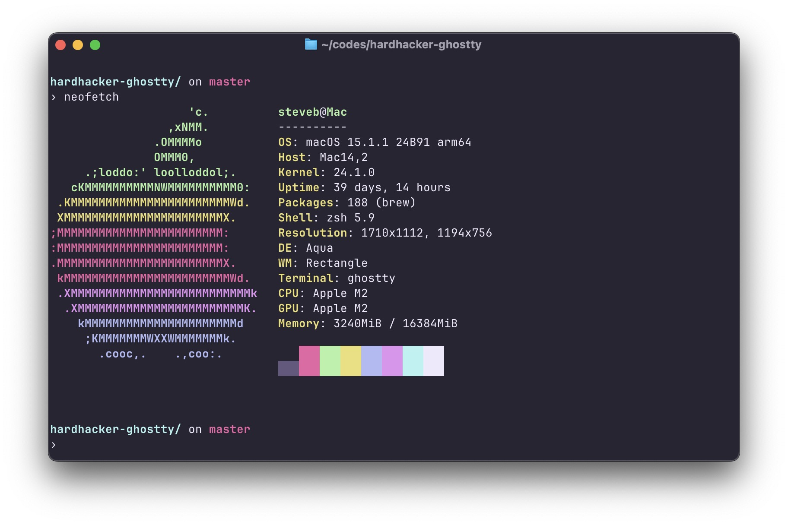

<p align="center">
  
</p>

<h1 align="center">
  HardHacker Theme for Ghostty
</h1>



## Install

### Download

Download just the theme file directly to your ghostty config folder [directly](https://github.com/stevebosworth/hardhacker-ghostty/releases/download/v0.0.1/hardhacker)

or clone the repository:

```git clone https://github.com/stevebosworth/hardhacker-ghostty.git```

### Import

Import the theme file 'hardhacker' to `~/.config/ghostty/themes/`:

```cp -r hardhacker ~/.config/ghostty/themes/```

Add the following line to your `~/.config/ghostty/config`:

```theme = hardhacker```
